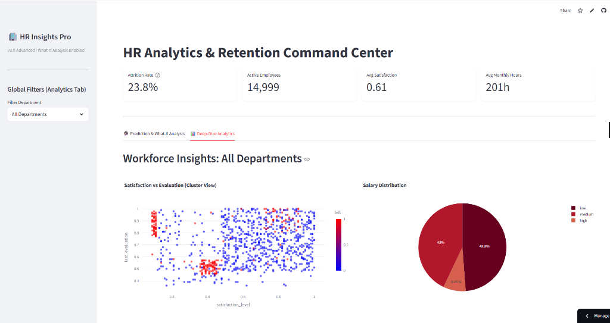
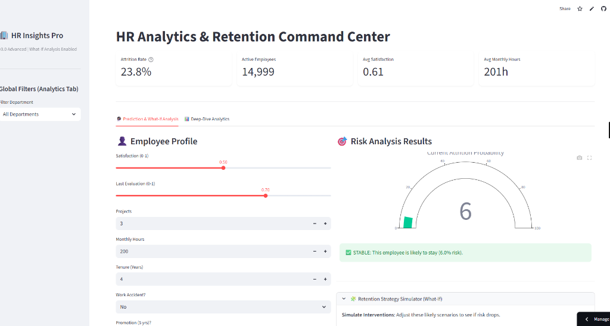

# HR Analytics: Employee Attrition Prediction 📊

[](https://www.python.org/)
[](https://streamlit.io/)
[](https://scikit-learn.org/)

---

## ⚡ Run This First (Quick Start)
To get the project up and running in less than 2 minutes:

1. **Install Dependencies**:
   ```bash
   pip install -r requirements.txt
   ```
2. **Launch the Dashboard**:
   ```bash
   streamlit run app.py
   ```
*This will open the interactive attrition predictor in your default browser.*

---

## 📸 Project Demo (v3.0 Advanced)

### 1. Global Analytics Command Center
Interactive filtering by department, visualized with cluster maps and distribution charts.


### 2. Predictive Risk & Retention Simulator
Predicts attrition risk and includes a **"What-If" Analysis** tool to simulate how salary hikes or promotions can reduce turnover.


---

## 📌 Project Overview
Successfully predicting employee attrition is vital for any organization. This project leverages **HR Analytics** to identify factors driving employee turnover and provides an interactive tool for predicting potential attrition using state-of-the-art machine learning models.

## 🚀 Key Improvements (v3.0)
I have transformed this repository into an Advanced HR Intelligence System:
- **🧠 Retention Strategy Simulator**: A Prescriptive Analytics tool that tells HR *how* to retain employees (e.g., "Raising salary reduces risk by 15%").
- **🎛️ Dynamic BI Dashboard**: Global sidebar filters allow deep-diving into specific departments (Sales, R&D, etc.).
- **⚡ High-Performance Architecture**: Models are pre-trained and serialized for instant loading.
- **🛡️ Cloud-Native Stability**: Robust error handling and fallback training for seamless deployment.

---

## 📂 Project Structure
```text
HR-Analytics/
├── app.py                  # Streamlit Dashboard
├── requirements.txt        # Project Dependencies
├── data/
│   └── hr_analytics.xlsx   # Employee Dataset
├── notebooks/
│   └── HR_Attrition_Analysis.ipynb  # Comprehensive Analysis
└── README.md
```

---

## 🛠️ Technologies Used
- **Language**: Python 🐍
- **Analysis**: Pandas, NumPy
- **Visualization**: Matplotlib, Seaborn
- **Machine Learning**: Scikit-Learn, XGBoost
- **Web App**: Streamlit

---

## 🔍 Key Insights from Analysis
- **Satisfaction Level**: The single most significant predictor of attrition. Low satisfaction strongly correlates with employees leaving.
- **Tenure**: Employees with 3-5 years at the company show higher turnover risk (plateau effect).
- **Workload**: Both extreme overwork (>250 hours/month) and extreme underwork (<150 hours/month) drive attrition.

---

## 🤖 How to Run

### 1. Prerequisites
Ensure you have Python installed. You can install all required libraries using:
```bash
pip install -r requirements.txt
```

### 2. Run the Analysis
Explore the detailed data science workflow:
```bash
jupyter notebook notebooks/HR_Attrition_Analysis.ipynb
```

### 3. Launch the Dashboard
Run the interactive prediction tool:
```bash
streamlit run app.py
```

---

## 📈 Model Performance
| Model | Accuracy | ROC-AUC |
|-------|----------|---------|
| Logistic Regression | ~78% | 0.81 |
| Random Forest | ~99% | 0.99 |
| XGBoost | ~98% | 0.99 |

---

## 👨‍💻 Author
**Shweta**

⭐ If you find this project helpful, please give it a star!
